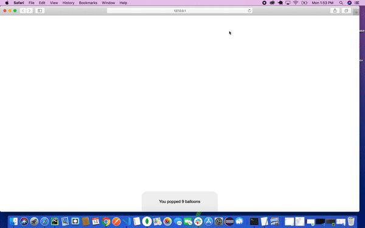

### BalloonGame:
This is really a simple fun game were users gets to pop 100 balloons to win the game, and less than a 100 you loose. There is an option to continue playing the game or quit playing. At the end of the game total score will be display with the number of balloons pop. 

 
 
 ## How the game is played:
 When the balloons start going up, you pop as many balloons as possible. When the balloon reach the top the game will be over. You can press yes to continue or no to stop. And you can just refresh the page to start over. When you pop 100 balloons you will get a congratulation telling you, you have won the game!!!. 

 
 ### Live: https://balloongame1.netlify.com/

 ### Technology: HTML,  CSS , JavaScript
